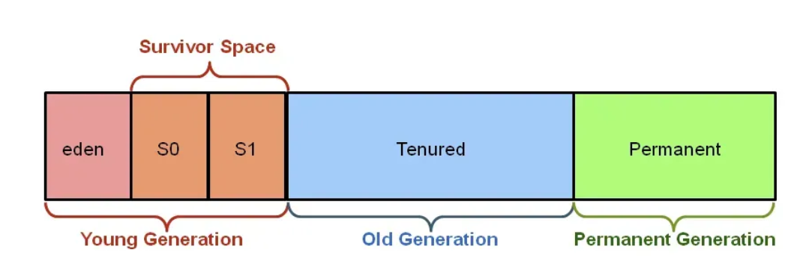

# Week 2: How to Java Work

1. JDK, JVM, và JRE khác nhau như thế nào? Vai trò của từng thành phần trong hệ sinh thái Java?

    Answer:
   - JDK (Java Development Kit): là một tập hợp các công cụ cần thiết để phát triển ứng dụng Java, bao gồm jre, java, javac,....
     - Cung cấp mọi thứ để lập trình viên viết, biên dịch, chạy và debug chương trình Java.
     - Chứa JRE và các công cụ lập trình như javac (Java Compiler), java (trình chạy Java), javadoc, jdb (Java Debugger),..
     - Hỗ trợ phát triển cả ứng dụng Java SE (Standard Edition), Java EE (Enterprise Edition), và Java ME (Micro Edition).
   - JRE (Java Runtime Environment): là môi trường cần thiết để chạy các ứng dụng Java.
     - Cung cấp JVM để chạy mã bytecode
     - Chứa các thư viện Java (Java API) như java.lang, java.util, java.io,
     - Cung cấp các thành phần hỗ trợ như bộ thu gom rác (Garbage Collector), trình quản lý bộ nhớ (Memory Manager).
   - JVM (Java Virtual Machine):là thành phần chính giúp Java có thể chạy trên nhiều nền tảng khác nhau mà không cần sửa đổi mã nguồn (Write Once, Run Anywhere).
     - chạy mã bytecode (mã biên dịch từ Java).
     - Quản lý bộ nhớ, kiểm tra bảo mật, thực hiện cơ chế Garbage Collection.
     - Tối ưu hiệu suất bằng Just-In-Time (JIT) Compiler để tăng tốc độ thực thi mã bytecode.

2. JDK có những công cụ nào quan trọng cho lập trình viên Java?

    Answer:
- | Công cụ   | Chức năng                 | Cách dùng                     |
  |-----------|---------------------------|--------------------------------|
  | `javac`   | Biên dịch Java            | `javac Hello.java`             |
  | `java`    | Chạy Java                 | `java Hello`                   |
  | `jshell`  | Chạy Java tương tác       | `jshell`                       |
  | `jar`     | Tạo file JAR              | `jar cf app.jar Hello.class`   |
  | `jdb`     | Debug Java                | `jdb -attach localhost:5005`   |
  | `javap`   | Giải mã bytecode          | `javap -c Hello.class`         |
  | `jconsole`| Giám sát JVM              | `jconsole`                     |

     - Công cụ biên dịch và thực thi
     - javac: Trình biên dịch Java, chuyển mã nguồn .java thành mã bytecode .class.
     - java: Chạy chương trình Java bằng cách thực thi mã bytecode trên JVM.
     - javap: Trình phân tích mã bytecode, giúp xem cấu trúc của file .class.
   - Công cụ gỡ lỗi và kiểm thử
     - jdb	Trình gỡ lỗi (Java Debugger) giúp kiểm tra và sửa lỗi trong chương trình.
     - jconsole: Giám sát hiệu suất ứng dụng Java bằng giao diện đồ họa.
     - jstack: Hiển thị thông tin về các luồng đang chạy trong JVM.
     - jinfo: Lấy thông tin về cấu hình JVM của một tiến trình đang chạy.
   - Công cụ phân tích hiệu suất
     - jstat: Theo dõi hiệu suất JVM (GC, memory, CPU, ...).
     - jmap: Kiểm tra thông tin bộ nhớ heap của JVM.
     - jhat: Phân tích heap dump để phát hiện rò rỉ bộ nhớ.
     - jcmd: Công cụ all-in-one để gửi lệnh đến JVM.
   - Công cụ quản lý gói và thư viện
     - jar: Tạo và quản lý tệp .jar chứa mã Java đóng gói.
     - jlink: Tạo JRE tùy chỉnh chỉ chứa những phần cần thiết.
     - jdeps: Phân tích sự phụ thuộc của mã nguồn Java.
   - Công cụ bảo mật
     - keytool: Quản lý chứng chỉ bảo mật (SSL, keystore).
     - jarsigner: Ký và xác minh chữ ký số của tệp .jar.

3. JVM hoạt động như thế nào khi bạn chạy một chương trình Java?

    Answer:
   - javac sẽ biên dịch thành bytecode và lưu dưới dạng file nhị phân là .class
   - sau đó classLoader sẽ tải file .class vào RAM để JVM xử lý.
   - JVM sử dụng Bộ thực thi mã (Execution Engine) để chạy chương trình.
     - Interpreter (Trình thông dịch): Đọc từng lệnh Bytecode và dịch sang mã máy, nhưng tốc độ chậm.
     - JIT Compiler (Just-In-Time Compiler): Biên dịch toàn bộ mã thành mã máy khi cần thiết để tăng hiệu suất.
   - sau cùng JVM quản lý bộ nhớ tự động bằng Garbage Collector (GC).

4. Có những thành phần quan trọng nào bên trong JVM?

	Answer:
   - CLASS LOADER
     - Loading: boostrap -> extension -> application :tải thư viện rồi tải các dòng code 
     - Linking: verify -> prepare -> resolve(symbolic references -> direct references) :Kiểm tra cú pháp, phân bổ bộ nhớ cho biến static.
     - Initialization: Khởi tạo các biến static, gán giá trị và thực thi các khối static {}.
   - RUNTIME DATA AREAS: method area, heap, stack, pc register, native method
   - EXECUTION ENGINE: interpreter, JIT compiler, GC collection
   - NATIVE METHOD INTERFACE(JNI)
   - NATIVE METHOD LIBRARY

5. JVM quản lý bộ nhớ như thế nào? Các vùng nhớ quan trọng trong JVM là gì?

    Answer:
   - METHOD AREA: 
     - lưu trữ thông tin của class: constant pool, metadata, method, constructor
     - chia sẻ các threads
   - HEAP AREA:
     - chia sẻ các threads chỉ sử dụng cho global variables
     - chứa object và dữ liệu instance
     - quản lý bởi GB collection
   - STACK AREA:
     - lưu local variable theo cơ chế FILO
   - PC REGISTERS:
     - đánh dấu dòng code tiếp theo cần thực thi
   - NATIVE METHOD STACK:
     - Hỗ trợ các phương thức gốc (native methods) gọi từ Java.

6. Class Metadata (Method Area) trong JVM có vai trò gì?

    Answer:
   - lưu trữ thông tin của class
   - Chứa Runtime Constant Pool

7. PermGen và Metaspace khác nhau như thế nào? Tại sao Java chuyển từ PermGen sang Metaspace từ Java 8?

    Answer:
   - PermGen là một phần của Heap Memory trong JVM trước Java 8, lưu trữ thông tin về class, method, và metadata của ứng dụng.
   - Do giới hạn kích thước cố định nên dễ bị lỗi OutOfMemoryError
   - Nên metaspace để giải quyết vấn đề đó
   - Metaspace có thể tăng kích thước tự động được lưu trong method area

8. Heap và Stack trong JVM khác nhau như thế nào?

    Answer:
   - | **Tiêu chí**  | **Heap Memory** | **Stack Memory** |
     |--------------|----------------|----------------|
     | **Chức năng** | Chứa các đối tượng (`Object`) và dữ liệu cấp phát động | Chứa biến cục bộ, lời gọi hàm (method call), và thông tin thực thi |
     | **Vị trí** | Nằm trong bộ nhớ **Heap** của JVM | Mỗi Thread có một Stack riêng |
     | **Quản lý bộ nhớ** | Do **Garbage Collector (GC)** quản lý | Quản lý theo cơ chế **LIFO (Last-In-First-Out)** |
     | **Tốc độ** | Chậm hơn vì phải quản lý bởi GC | Nhanh hơn vì được quản lý trực tiếp theo từng Thread |
     | **Dữ liệu chứa** | - Các đối tượng (`Object`)   - Static Variables (`static`)   - String Pool (`String` literals) | - Biến cục bộ (`Local Variables`)   - Tham chiếu đến đối tượng trong Heap   - Thông tin phương thức đang thực thi |
     | **Vòng đời** | Kéo dài từ khi đối tượng được tạo cho đến khi bị GC thu hồi | Biến mất khi phương thức kết thúc |
     | **Phạm vi truy cập** | Chia sẻ giữa nhiều Thread | Mỗi Thread có Stack riêng, không thể truy cập từ Thread khác |

10. Garbage Collection trong JVM là gì? Tại sao nó quan trọng?

    Answer:
    - Garbage Collection (GC) trong JVM là quá trình tự động thu hồi bộ nhớ bằng cách loại bỏ các đối tượng không còn được sử dụng hoặc tham chiếu nữa. 
    - Điều này giúp tránh rò rỉ bộ nhớ (Memory Leak) và tối ưu hóa hiệu suất ứng dụng Java.
    - 

11. Những thuật toán chính của Garbage Collection mà JVM sử dụng là gì?

    Answer:
    - | **Thuật toán**            | **Cơ chế hoạt động** | **Ưu điểm** | **Nhược điểm** |
      |---------------------------|---------------------|------------|---------------|
      | **Mark-Sweep**            | Đánh dấu (Mark) các đối tượng còn sống, sau đó quét dọn (Sweep) bộ nhớ. | Đơn giản, dễ triển khai. | Phân mảnh bộ nhớ. |
      | **Mark-Compact**          | Đánh dấu các đối tượng còn sống, sau đó dồn chúng lại (Compact) để tránh phân mảnh. | Giảm phân mảnh bộ nhớ. | Tốn tài nguyên khi di chuyển đối tượng. |
      | **Copying (Copy GC)**     | Chia Heap thành hai phần, chỉ sử dụng một nửa, sao chép các đối tượng còn sống sang vùng trống. | Không bị phân mảnh, nhanh với bộ nhớ nhỏ. | Tốn gấp đôi bộ nhớ. |
      | **Generational GC**       | Chia Heap thành **Young Generation** và **Old Generation**, xử lý GC theo từng thế hệ. | Tối ưu hiệu suất cho ứng dụng lớn. | Phức tạp hơn so với GC đơn giản. |
      | **G1 (Garbage First) GC** | Chia Heap thành các vùng nhỏ, ưu tiên dọn dẹp vùng có nhiều rác nhất trước. | Hiệu suất cao, giảm thời gian pause. | Cần nhiều tài nguyên hơn. |
      | **ZGC (Z Garbage Collector)** | GC thế hệ mới, thực hiện gần như không gián đoạn (low-latency). | Phù hợp ứng dụng yêu cầu độ trễ thấp. | Chỉ hỗ trợ từ Java 11 trở lên. |
      | **Shenandoah GC**         | Tương tự ZGC, giảm thời gian pause bằng cách GC song song với luồng ứng dụng. | Hiệu suất cao, giảm gián đoạn. | Cần phần cứng mạnh. |

12. JVM có những loại Garbage Collector nào? Khác nhau ở điểm nào?

    Answer:
    - | Loại GC                | Cách hoạt động | Ưu điểm | Nhược điểm | Cách bật |
      |------------------------|---------------|---------|------------|----------|
      | **Serial GC**         | Dùng một luồng đơn để thu gom rác. | Tiêu tốn ít tài nguyên, phù hợp với ứng dụng nhỏ. | Dừng toàn bộ ứng dụng trong quá trình thu gom rác (**Stop-the-world**). | `-XX:+UseSerialGC` |
      | **Parallel GC**       | Dùng nhiều luồng để thu gom rác trong Young Generation. | Tận dụng nhiều CPU để tăng hiệu suất. | Vẫn có thời gian dừng ứng dụng khi thu gom Old Generation. | `-XX:+UseParallelGC` |
      | **G1 GC (Garbage First)** | Chia heap thành nhiều vùng nhỏ (Regions), thu gom rác theo mức độ ưu tiên. | Giảm thời gian dừng ứng dụng, cân bằng giữa hiệu suất và độ trễ. | Phức tạp hơn, tiêu tốn tài nguyên CPU nhiều hơn Serial và Parallel GC. | `-XX:+UseG1GC` |
      | **CMS GC (Concurrent Mark-Sweep)** | Thu gom rác đồng thời với ứng dụng, giảm thời gian dừng. | Giảm độ trễ cho ứng dụng cần phản hồi nhanh. | Tiêu tốn nhiều CPU hơn, có thể gây phân mảnh bộ nhớ. | `-XX:+UseConcMarkSweepGC` |
      | **ZGC (Z Garbage Collector)** | Dọn dẹp bộ nhớ mà gần như không có thời gian dừng ứng dụng. | Độ trễ cực thấp (<10ms), phù hợp với ứng dụng yêu cầu hiệu suất cao. | Dùng nhiều bộ nhớ hơn, chỉ hỗ trợ từ Java 11 trở lên. | `-XX:+UseZGC` |
      | **Shenandoah GC**     | Dọn dẹp rác song song với luồng ứng dụng. | Độ trễ thấp hơn G1, giảm ảnh hưởng đến hiệu suất ứng dụng. | Tốn CPU hơn G1, yêu cầu Java 12+ (trước Java 17 là tính năng thử nghiệm). | `-XX:+UseShenandoahGC` |

13. Sự khác biệt giữa Minor GC, Major GC và Full GC là gì?

    Answer:
    - 
    - Minor GC
      - Diễn ra trong Young Generation (Eden + Survivor spaces).
      - Khi nào xảy ra? Khi vùng Eden đầy, Minor GC sẽ thu gom rác và di chuyển các đối tượng sống sót sang Survivor hoặc Old Generation.
      - Tác động: Thường có stop-the-world nhưng thời gian ngắn vì chỉ quét vùng nhớ nhỏ.
      - Hiệu suất: Rất nhanh, nhưng có thể tạo áp lực nếu đối tượng quá lớn hoặc quá nhiều.
    - Major GC (Old GC)
      - Diễn ra trong Old Generation.
      - Khi nào xảy ra? Khi vùng Old Generation đầy và cần thu gom rác.
      - Tác động: Dừng ứng dụng lâu hơn Minor GC vì quét một vùng nhớ lớn hơn.
      - Hiệu suất: Chậm hơn Minor GC, có thể gây gián đoạn nếu không được tối ưu.
    - Full GC
      - Diễn ra trên toàn bộ heap memory (Young + Old + Metaspace).
      - Khi nào xảy ra? Khi JVM quyết định cần thu gom toàn bộ bộ nhớ, chẳng hạn khi không gian heap bị phân mảnh hoặc khi không thể cấp phát bộ nhớ mới.
      - Tác động: Stop-the-world lâu nhất, ảnh hưởng đến hiệu suất ứng dụng.
      - Hiệu suất: Cần tránh xảy ra thường xuyên bằng cách tối ưu bộ nhớ, cấu hình GC phù hợp.

14. Bộ nhớ Stack có bị thu hồi bởi Garbage Collector không? Nếu không, nó được quản lý như thế nào?

    Answer:
    - không bởi vì mỗi stack nó là 1 thread riêng nên mỗi lần xong là nó sẽ tự động mất

15. Làm thế nào để tránh Memory Leak trong Java?

    Answer:
    - Memory Leak xảy ra khi các đối tượng trong heap không còn được sử dụng nhưng vẫn còn tham chiếu, khiến Garbage Collector (GC) không thể thu hồi chúng.
      - đóng connection
      - 

16. JIT Compiler trong JVM là gì? Nó cải thiện hiệu năng như thế nào?

    Answer:
    - JVM sử dụng interpreter ể dịch byte code và khởi động chương triình nhanh chóng
    - JIT theo dõi đoạn mã nào được thực thi nhều lần (hotspot) và biên dịch đoạn mã đó sang mã máy và lưu lại cho những lần sử dụng sau
    - Cold code được xử lý bởi interpreter và hot code được xử lý bởi JIT compiler

17. Khi nào JIT Compiler dịch mã bytecode sang mã máy thực thi?

    Answer:
    - khi xuất hiện hot code gọi là hotspot

18. Khi ứng dụng Java chạy chậm, bạn sẽ kiểm tra gì đầu tiên?

    Answer:
    - Kiểm tra CPU & RAM sử dụng
    - Kiểm tra Garbage Collection 
    - 

20. Làm thế nào để debug lỗi liên quan đến bộ nhớ Heap và Stack?

    Answer: