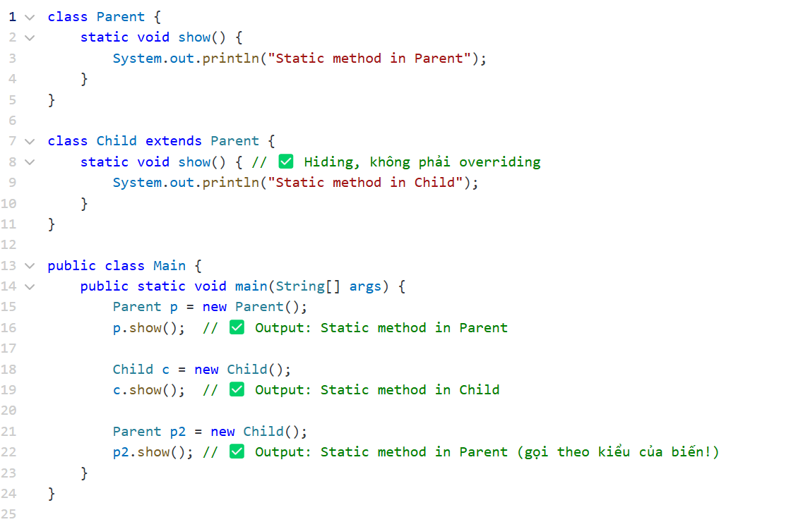

# Week 3: OOP

1. Lập trình hướng đối tượng là gì? So sánh với hướng lập trình thủ tục

- Answer:
  - Lập trình hướng đối tượng (Object-Oriented Programming - OOP): là lập triình với đối tượng
  - object là thực thể có thể có các thuộc tính và hành vi
  - class là bản thiết kế để đúc ra object

2. Giải thích 4 nguyên tắc cơ bản OOP: Encapsulation, abstraction, Inheritance, Polymorphism

- Answer:
  - Đóng gói (Encapsulation): Che giấu dữ liệu và chỉ cho phép truy cập thông qua các phương thức được chỉ định. 
  - Kế thừa (Inheritance): Lớp con có thể kế thừa thuộc tính, phương thức từ lớp cha, giúp tái sử dụng mã nguồn. 
  - Đa hình (Polymorphism): Một phương thức có thể có nhiều cách triển khai khác nhau (method overloading, method overriding). 
  - Trừu tượng (Abstraction): Ẩn đi các chi tiết không cần thiết, chỉ tập trung vào những gì quan trọng.

3. Interface và abstract Class khác nhau như thế nào?

- Answer:
  - Interface là 1 abstract class chứa các phương thức trừu tượng nhưng ko có thộc trính trừu static final
  - 1 class có thể implements nhiều interface nhưng chỉ có thể extend 1 abstract class
  - 

4. Một class có thể kế thừa nhiều class cùng lúc không? nếu không thì tại sao?

- Answer:
  - java ko hỗ trợ đa kế thừa bởi vì có thể gây lỗi
  - ví dụ có class cha là A thì B và C extend method active() của A sau đó D extend sẽ gây ra lỗi bởi vì java ko bt chọn cái nào
  - thay vào đó ta có thể sử dụng interface 

5. Làm thế nào để đảm bảo một class tuân theo nguyên tắc Encapsulation
- Answer:
  - sử dụng private dành cho các thuộc tính và getter, setter để có thể truy cập hoặc sửa dữ liệu
  - sử dụng constructor để tạo object
  - chỉ sử dụng setter khi cần thiết ví dụ setID là quan trọng nên ko nên sửa
  - 

6. Tại sao nên sử dụng getter và setter thay vì truy cập trực tiếp biến instance?
- Answer:
  - bởi vì để kiểm soát dữ liệu 

7. Một class có thể vừa là abstract class và là interface được không? Tại sao Java không hỗ trợ đa kế thừa với class, nhưng lại hỗ trợ đa kế thừa với interface?
- Answer:
  - ko bởi vì đây là 2 khái niệm khác nhau
  - bởi vì interface chỉ chứa các phương thức trừu tượng nên ko ảnh hưởng 
  - cho dù có nhiều phương thức trùng tên thì java vẫn overide bth bởi vì nó là abstract
  - 

8. Khi nào sử dụng abstract class thay vì interface?
- Answer:
  - khi muốn kế thừa các thuộc tính và phương thức của class cha

9. Sự khác nhau giữa method overloading và method overriding
- Answer:
  - Overloading: cùng tên nhưng khác đâu vào
  - Overriding: là method kế thừa từ class cha cần có @Override

10. Có thể override một phương thức static không? về mặt ý nghĩa thì tại sao?
- Answer:
  - Khi một phương thức là static, nó không thuộc về một instance cụ thể của class mà thuộc về chính class đó.
  - 

11. Garbage Collection hoạt động như thế nào trong Java? Làm sao để buộc hệ thống thực hiện thu gom rác?
- Answer: 
  - Garbage Collector sẽ quét bộ nhớ heap và loại bỏ các đối tượng không còn được tham chiếu. Quá trình này diễn ra theo các bước:đánh dấu, dọn dẹp, nén bộ nhớ
  - System.gc(); 
  - Runtime.getRuntime().gc();
